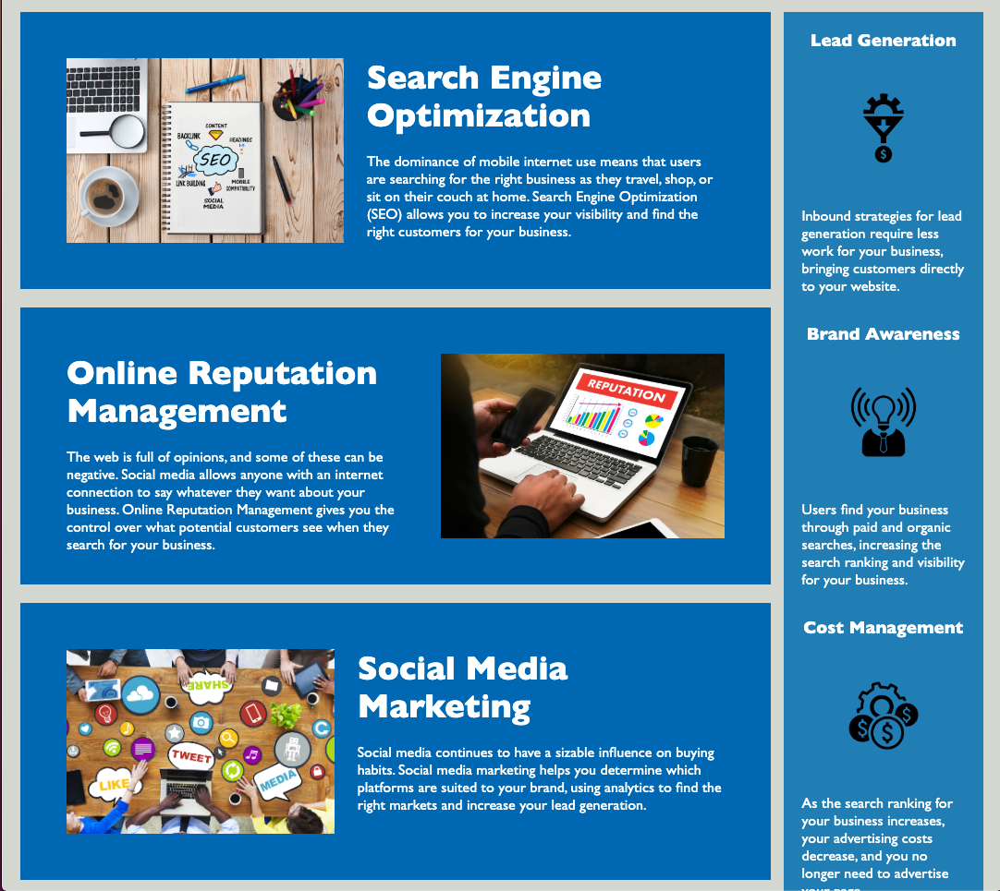

# challenge-code-refactor
Challenge 1

Optimizing code for search engines  
CSS selectors/properties are consolidated and semantic  
Links are functional  

Screenshots: 

URL: 
https://github.com/nicolewallace09/challenge-code-refactor 
https://nicolewallace09.github.io/challenge-code-refactor/